# 1.1 Створіть схему pandemic у базі даних за допомогою SQL-команди.;
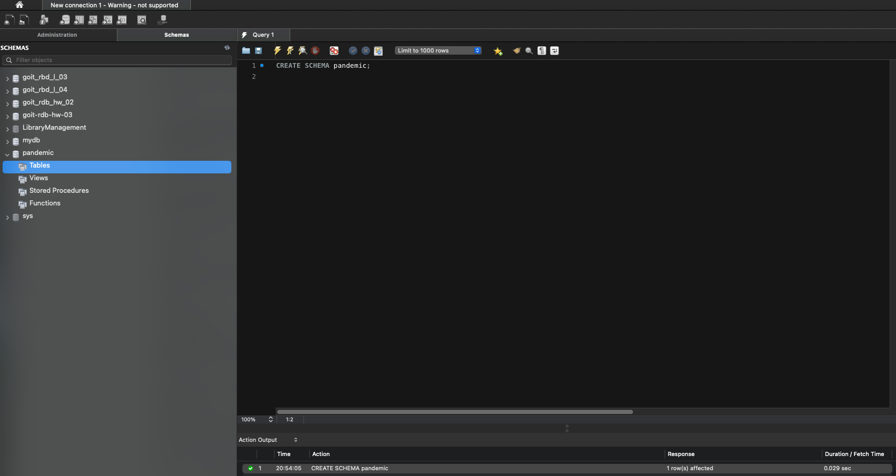

# 1.2 Оберіть її як схему за замовчуванням за допомогою SQL-команди.;
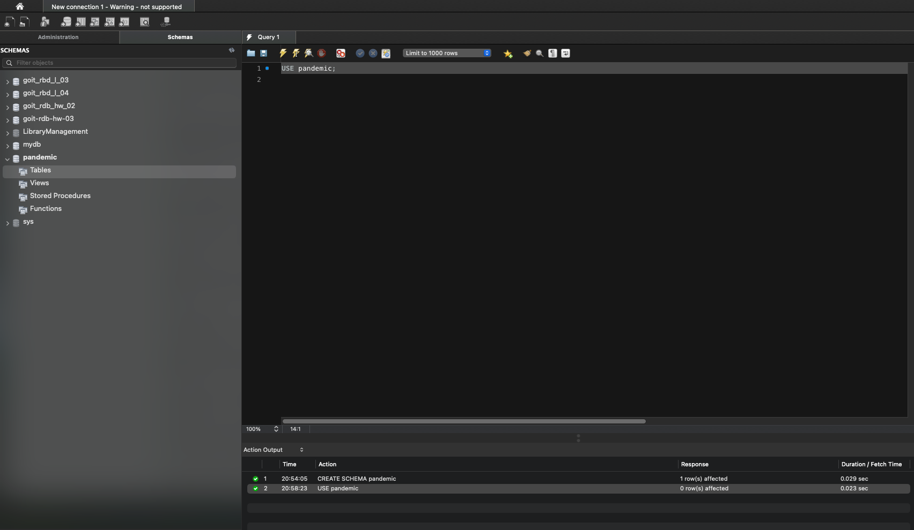

# 1.3 Імпортуйте дані за допомогою Import wizard так, як ви вже робили це у темі 3.;
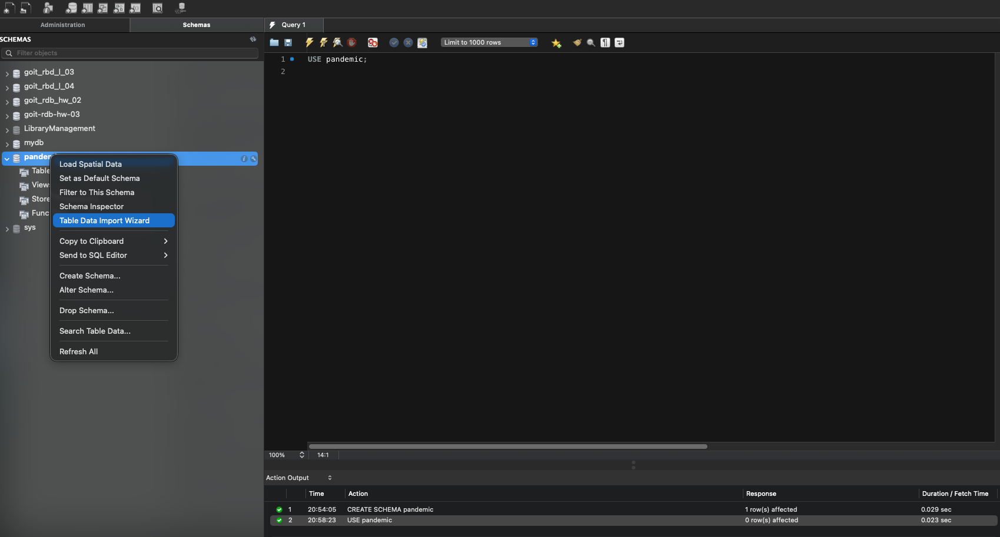

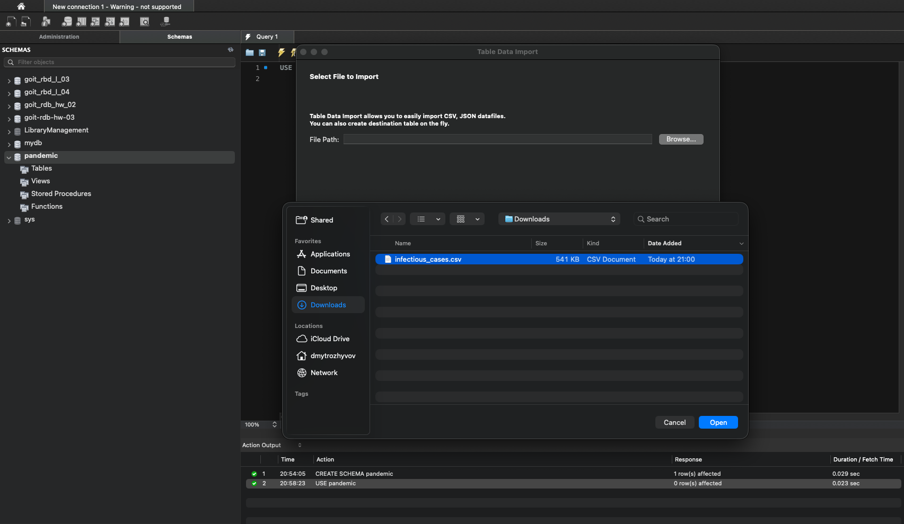

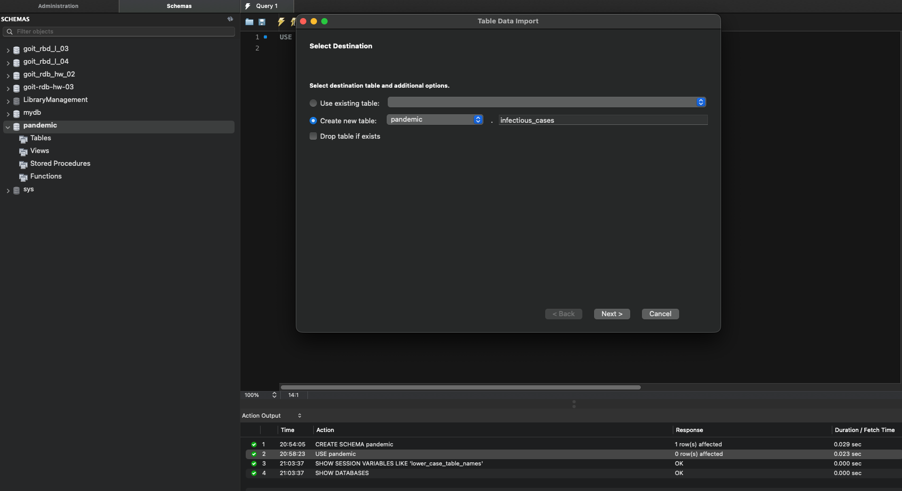

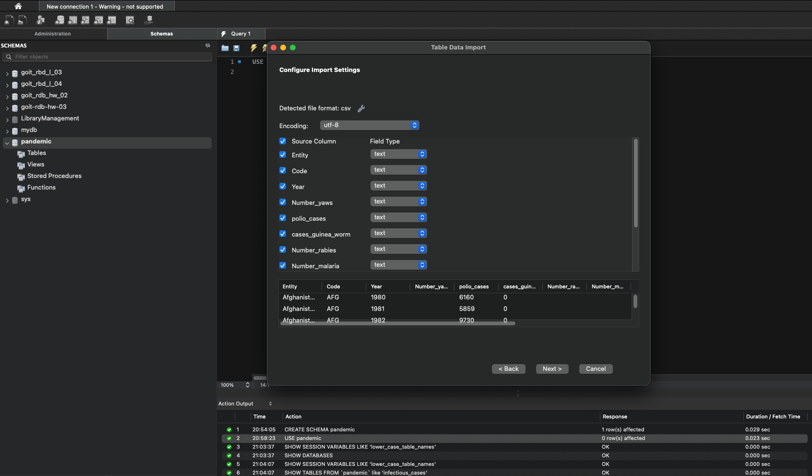

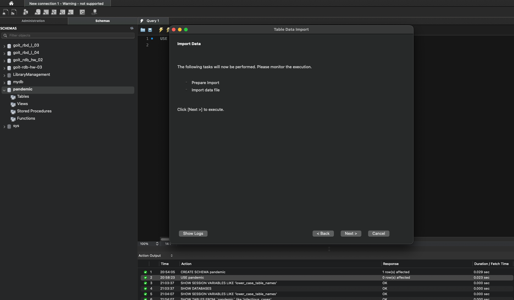

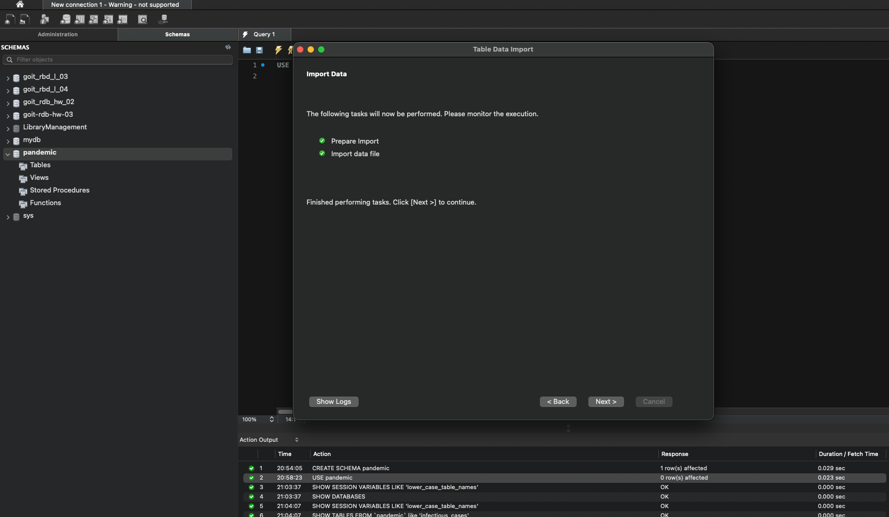

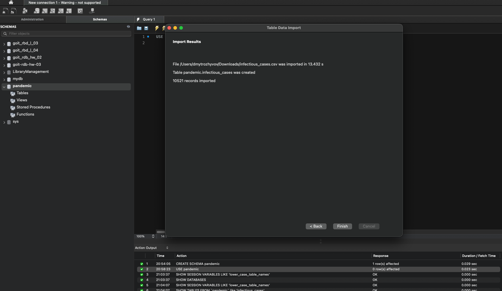

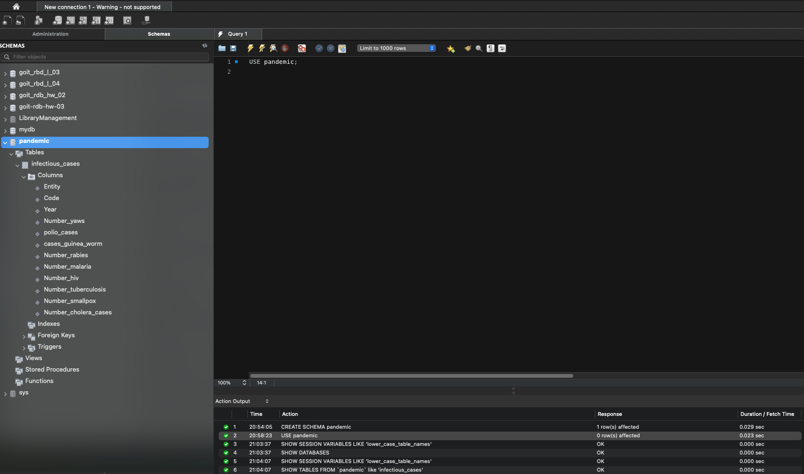

# 1.4-2.1 Нормалізуйте Entity та Code;
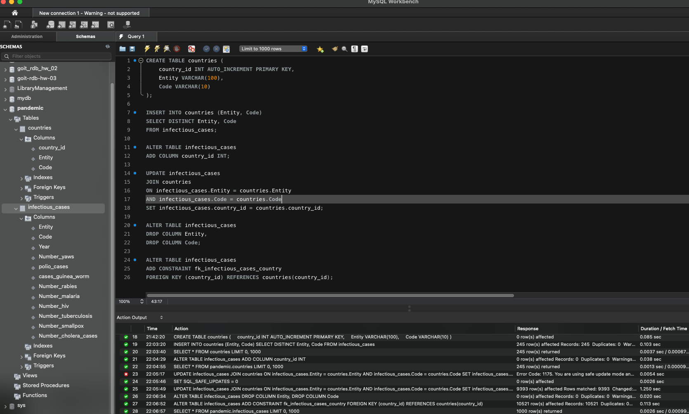

# 2.2 Виконайте запит SELECT COUNT(*) FROM infectious_cases ;
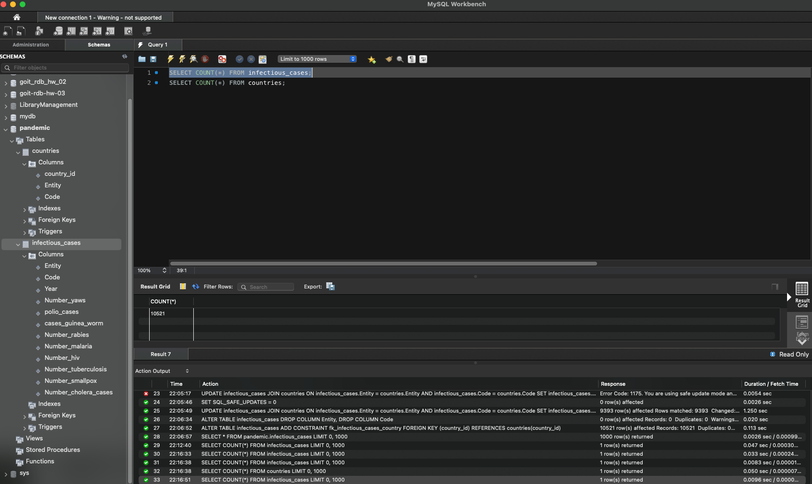

# 3 Для кожної унікальної комбінації Entity та Code або їх id порахуйте середнє, мінімальне, максимальне значення та суму для атрибута Number_rabies;
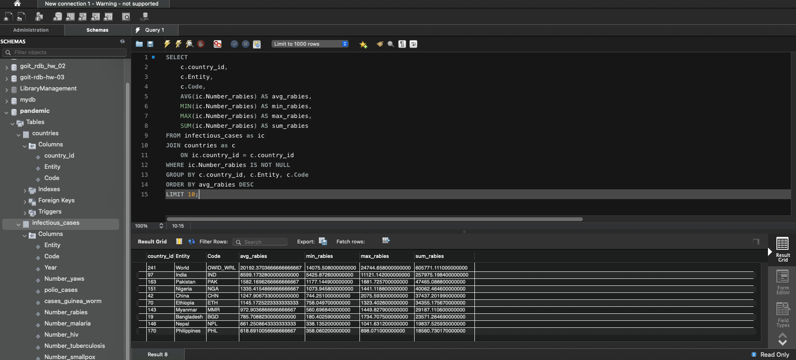

# 4 Побудуйте колонку різниці в роках.;
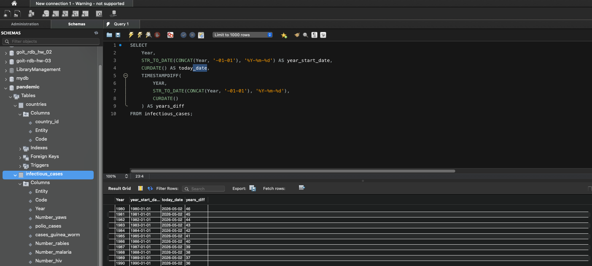

# 5 Побудуйте власну функцію.;
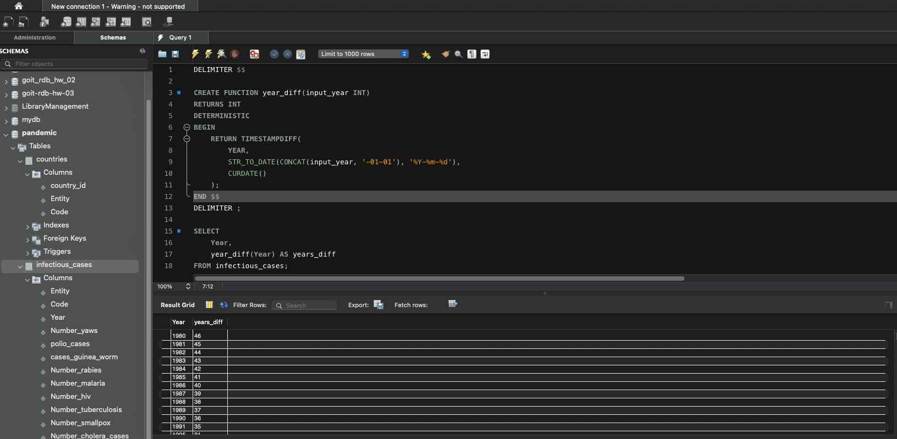